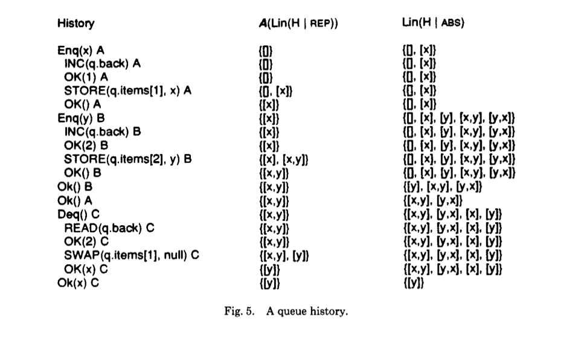
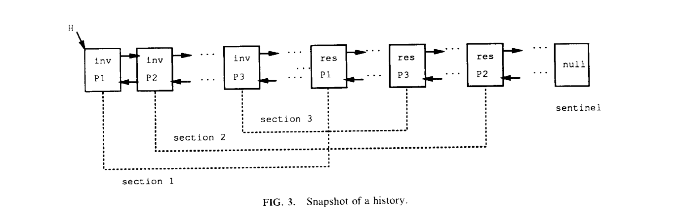

# Linearizability一致性验证

上篇文章介绍了[TiDB](https://github.com/pingcap/tidb)如何使用[Jepsen](https://github.com/jepsen-io/jepsen)来进行一致性验证，并且介绍了具体的测试案例，但是并没有对Jepsen背后的一致性验证算法做过多介绍。这篇文章将会深入Jepsen的核心库[knossos](https://github.com/jepsen-io/knossos)，介绍knossos库所涉及的**Linearizability（线性化）一致性验证算法**。

## Linearizability一致性模型

* 什么是一致性模型？

  一致性模型确定了编写系统的程序员与系统之间的某种协议，如果程序员遵守了这种协议，那么这个系统就能提供某种一致性。常见的一致性模型有：

  + Strict Consistency
  + Linearizability (Atomic Consistency)
  + Sequential Consistency
  + Casual Consistency
  + Serializability
  + ……

  需要注意的是这里的系统指并发系统，分布式系统只是其中的一类。

* 什么是Linearizability？

  首先我们需要引入*历史*（history）的概念，*历史*是并发系统中由*invocation*事件和*response*事件组成的有限序列。

  > invocation: <x op(args*) A>，x表示被执行对象的名称；op表示操作名称，如读和写；args*表示一系列参数值；A表示进程的名称
  >
  > response：<x term(res*) A>，term表示结束（termination）状态；res*表示一系列结果值
  >
  > 如果invocation和response的x（对象）和A（进程）相同，那么我们认为它们是对应操作，并且complete(H)表示历史中的最多成对操作

  当我们的*历史*H满足以下条件时我们把它称为*顺序化*（sequential）历史：

  1. H中的第一个事件是invocation
  2. 除了可能的最后一个事件外，每个invocation事件都紧跟着对应[^对应意味着对象和进程相同]的response事件；每个response事件都紧跟着对应的invocation事件

  > $$H|A$$代表只含有进程A操作的子历史，$$H|x$$代表只含有对象x操作的子历史
  >
  > 定义well-formed：如果每个进程子历史$$H|A$$都是顺序化的，那么这个历史H就是well-formed。

  如果一个*历史*不是顺序化的话那么就是并发的。

  *历史*H在操作上引出非自反的偏序关系$$<_{H}$$：
  $$
  e_{0} <_{H} e_{1}\;if\;res(e_{0})\;precedes\;inv(e_{1})\;in\;H
  $$
  这里的res和inv分别对应response和invocation。

  当*历史*H可以通过增加>=0个response事件被延长时成为H'并且满足以下两个条件时，则这个*历史*是**线性化（linearizable）**的。

  > L1: complete(H') 与某个合法的顺序化历史S相等
  >
  > L2: $$ <_{H}\;\subseteq\;<_{S} $$

  complete(H')表示进程以完整的操作进行交互，L2表示如果op1在H中先于op2存在（注意这里的先于强调实时发生的顺序real-time order），那么在S中也是这样。我们把S称为H的线性化点（linearization）。

  下面我们通过3个小例子来解释一下以上2个条件。

  ```
  q代表FIFO队列，A、B代表两个进程

  q Enq(x) A
  q Deq() B
  q Ok(x) B
  满足linearizable，虽然Enq(x)并没有返回Ok，但是我们可以通过增加这条返回语句使得上述语句与某个合法的顺序化历史相等

  q Enq(x) A
  q Ok() A
  q Enq(y) B
  q Ok() B
  q Deq() A
  q Ok(y) A
  如果满足linearizable那必然Enq(x)先于Enq(y)，但是Deq()是得到的却是y，所以违反了L2，因此这段历史不是线性化的

  q Enq(y) A
  q Ok() A
  q Deq() A
  q Deq() B
  q Ok(y) A
  q Ok(y) B
  不满足linearizable因为Enq(y)只执行了一次，却被Deq()了两次，不能与任何合法的顺序化历史相对应
  ```

  **Linearizability的性质**

  * 局部性（Locality），当且仅当H中每个对象x都是线性化的，才能保证H是线性化的
  * 非阻塞（Nonblocking），invocation事件不用等待对应的response事件


## 验证Linearizability

**正确（correctness）**的定义

> 一段历史H由两种对象组成，representation(REP)和abstract(ABS)。abstract是被实现的类型，而representation类型则是用于实现ABS的类型。这两种对象在以下条件下进行交互：
>
> 1. 子历史H|REP和H|ABS是well-formed
> 2. 对于每个进程P，在子历史H|P中，每一个rep操作都被abs操作所包含

对于某个实现中的所有历史H来说，如果H|ABS是线性化的，那么这个实现就是**正确**的。

REP值的子集中的合法表现由表达不变性（representation invariant）所表示：$$I: REP\rightarrow BOOL$$，一个合法表现的含义由抽象函数（abstract function）所表示：$$A: REP\rightarrow ABS$$。对于一个正确的实现$$p$$来说，存在一个表达不变性$$I$$，以及一个抽象函数$$A$$，并且无论何时$$p$$从一个合法的表达值$$r$$到达另一个表达值$$r^{'}$$，抽象操作$$a$$把抽象值$$A(r)$$变成$$A(r^{'})$$。

我们从最简单的队列（FIFO queue）入手。

```C
struct queue {
  int back;
  element *elements;
};

bool Enq(queue *q, element x)
{
  int i = INC(&q->back); // 原子自增并返回之前的值
  STORE(&q->elements[i], x); // 假设内存足够
  return true;
}

element Deq(queue *q)
{
  while (1) {
    int end = READ(&q->back); // 原子读取
    for (int i = 1; i < end; ++i) {
      element x = CAS(&q->elements[i], NULL); // 返回CAS之前的值
      if (x != NULL) return x;
    }
  }
}
```

Enq和Deq可以看做是abstract operation，而Enq和Deq中的每条语句可以看做是representation operation。

对线性化的历史的验证可以被转换为对顺序化历史的验证，对于给定的线性化历史，我们把最终线性化点的对象的值称为线性值。因为给定的历史可能有超过一个线性化点，所以这个对象可能会有多个线性值。我们用$$Lin(H)$$表示所有线性值的集合，可以把它们看作是系统外部的观察者所看到的值。

对于以下几个队列操作，对应的线性值分别有以下几种。

| History  |      Linearized values       |
| :------: | :--------------------------: |
|    \     |             {[]}             |
| Enq(x) A |          {[], [x]}           |
| Enq(y) B | {[], [x], [y], [x,y], [y,x]} |
|  Ok() B  |     {[y], [x,y], [y,x]}      |
|  Ok() A  |        {[x,y], [y,x]}        |
| Deq() C  |   {[x], [y], [x,y], [y,x]}   |
| Ok(x) C  |            {[y]}             |

为了证明正确性，我们需要保证：
$$
For\;all\;r\;in\;Lin(H|REP),\;I(r)\;holds\;and\;A(r)\subseteq Lin(H|ABS)
$$
其中$$H|REP$$和$$H|ABS$$都是线性化的，$$r$$代表$$H|REP$$的线性值，并且$$I(r)=(r.back \geq 1) \land (\forall i.\;i \geq r.back \Rightarrow r.elements[i] = null) \land (lbound(r.elements) = 1)$$，其中$$lbound$$是最小的数组索引（队列从1开始）；$$A(r) = \{ q\,|\,elements(r) = elements(q)\;\land <_{r} \subseteq<_{q}\}$$，其中偏序关系$$<_{r}$$表示如果被插入元素x的赋值操作先于y的自增操作，则$$x <_{r} y$$，$$<_{q}$$代表队列$$q$$的全序关系。

换句话说，队列的表现值（representation value）就是队列中的元素，这些元素的排列顺序与Enq操作的顺序一致。

下面这张图可以帮助你很好地理解上述公式的意思。第二列是线性化的表现值（linearized representation values），第三列是线性化的抽象值（linearized abstract values），可以看到每一行中第二列都是第三列的子集。



## Wing & Gong线性化算法

介绍完了如何证明linearizability，下面我们可以继续深入到knossos使用的两个核心算法之一——Wing & Gong Linearibility算法（WGL）。

>  WGL算法：对于给定的某个数据类型$$T$$，它的并发实现为$$ConcObj$$，而它的顺序化要求为$$SeqObj$$。对于给定的历史$$H$$，我们在保证$$H$$的实时顺序$$<_{H}$$的情况下尝试$$H$$的每一系列可能的顺序化操作，然后检查每个顺序化历史$$H_{S}$$在$$SeqObj$$上执行时是否是线性化的。如果$$H$$的每一种可能都失败了，那么这个历史就不是线性化的。

我们定义**历史**是由一系列**事件**组成的：

```C
typedef struct ev {
  char item;
  char op;
  struct ev *match, *prev, *next;
} event;
```

其中$$iterm$$是操作$$op$$的参数，$$name$$是进行操作的进程的名字，$$prev$$和$$next$$分别表示上一个和下一个事件，$$match$$指向其对应的返回（res）事件。

另外我们还需要区域以及lift(unlift)这个概念。

>  区域（Section）：由触发（inv）事件，对应的返回事件，以及它们中间包含的所有事件。



虚线同时可以看作是也是$$match$$指针。

> lift：将某对操作从历史中移出
>
> unlift：将移出的某对操作放回


这个算法的核心是一个搜索（Search）函数，如果历史$$H$$是线性化的，那么那么他返回一个线性化点（即顺序化历史$$S$$）。搜索使用一个栈来保存历史中已经线性化的部分，这个栈及栈中的元素是这样定义的：

```C
typedef struct {
  event *pi, *pr, *inv, *resp;
  char item, op, result;
} elt_stack;

typedef struct {
  elt_stack value[STACK_LENGTH];
  int in;
} stacktype;
```

其中$$pi$$和$$pr$$分别表示子历史中第一个没有被检查的区域；$$inv$$和$$resp$$表示子历史中第一对操作；$$item$$、$$op$$和$$result$$记录这对操作的信息。

一个完整的搜索函数是这样的：

1. 初始化栈

2. 通过$$current$$操作的$$pi$$和$$pr$$定位当前的区域，否则返回线性化点

3. 从当前区域开始，选择一个操作并且将它的信息存储在$$current$$中

4. 对选择的操作进行顺序化模拟，调用$$op$$

5. a：如果$$op$$返回真，意味着目前被检查的所有操作能够组成线性化的子历史，所以把这个操作推入栈中，并将这个操作从历史中移出，然后回到2

   b：1. 如果当前区域内还有一些未被选择的触发（inv）事件没有排在任何返回（res）事件之后，那么选择一个然后回到4

   2. 当前区域的所有操作已经被尝试但是失败了，所以我们需要将操作出栈然后尝试其他的顺序，如果栈是空的，那么意味着历史不是线性化的，函数返回；否则，将顶层元素出栈，这个元素包含了之前区域的所有信息，以及被选择的操作，然后undo之前的$$op$$，然后unlift这个操作，最后，设置$$current$$为之前区域的指针，然后回到5b1

这就是整个WGL算法。这个算法很简单也很好理解，但是有两个明显的缺点：

1. 一旦操作数量上升，整个算法会运行地很缓慢，因为可能会出现涉及大量回溯的操作
2. 这个算法只能验证是否线性化，一旦线性化不成立，却不能给出具体违反线性化的出错点

对此knossos库的第二个算法使用了WGL算法的改进版本。但是能力有限，只能给大家介绍这么多了，具体论文链接会在最后给出。


##### 最后的思考

这篇文章介绍了什么是Linearizability、Linearizability正确性的验证及其算法。这些算法在分布式系统中的应用只是一个很小的方面，算法本身是独立的，它只需要一个历史H，至于这个历史是随机生成的还是某个应用在实际中产生的并不重要。你可以使用这些算法对任何并发系统进行验证，小到一个无锁队列、Set，大到某个分布式系统。TiDB作为一个大型分布式系统却能被抽象化为一个队列、寄存器来被用作测试这本身就是一个很有意思的地方，同时也很好地展现了这些算法自身的魅力。


##### 参考

[Consistency Model](https://en.wikipedia.org/wiki/Consistency_model)

[Knossos](https://github.com/jepsen-io/knossos)

[Sequential Consistency](http://lamport.azurewebsites.net/pubs/multi.pdf)

[Linearizability](http://cs.brown.edu/~mph/HerlihyW90/p463-herlihy.pdf)

[Linearizability versus Serializability](http://www.bailis.org/blog/linearizability-versus-serializability/)

[WGL算法](http://www.cs.cmu.edu/~wing/publications/WingGong93.pdf)

[Testing for Linearizability](http://www.cs.ox.ac.uk/people/gavin.lowe/LinearizabiltyTesting/paper.pdf)

